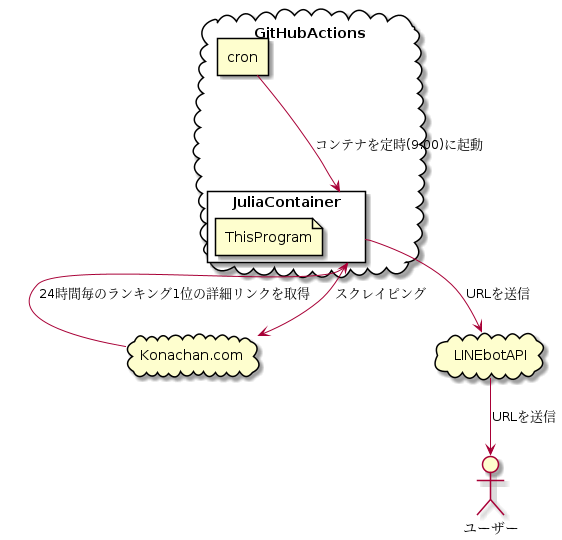

# PickPopular

## 概要

[Konachan.com](https://konachan.com)という画像投稿掲示板のなかで[日毎のランキング](https://konachan.com/post/popular_recent?period=1d)1位の画像の詳細リンクを毎朝送信するLINEbotです。

登録は下記のQRコードもしくは「友だち追加」ボタンから

## 構成

構成は下記の画像のとおり

## 環境構築

### PlantUMLの導入

 * 事前に `code` コマンドを実行できるようにしてから下記を実行する。(`code`の導入はvscodeのコマンドパレットで`shell`と打つと出る。)
 * `code --install-extension jebbs.plantuml`
 * vscodeの設定で `Plantuml: Render` を `PlantUMLServer` にする。
 * vscodeの設定で `Plantuml: Server` を `http://localhost:8080` にする。
 
### PlantUMLのDocker上で実行

 * `docker run -d -p 8080:8080 plantuml/plantuml-server:jetty`
